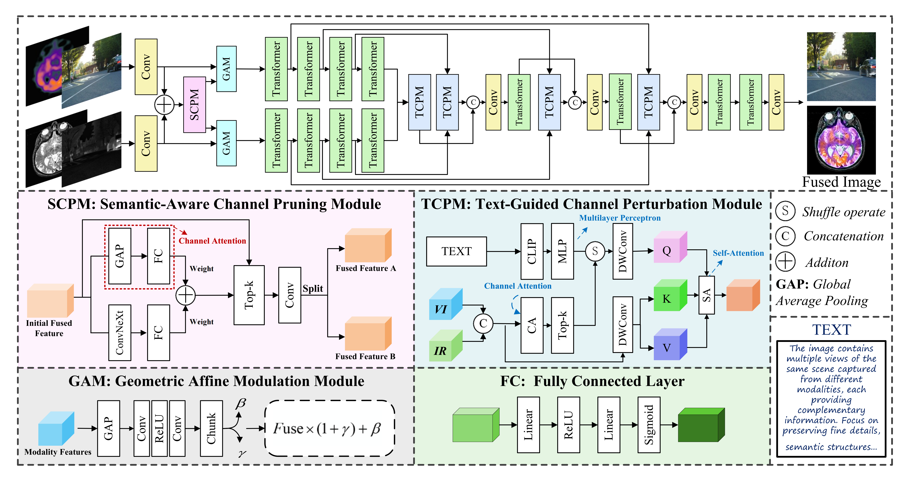

# 🧠 UP-Fusion — AAAI 2026

**Text-Guided Channel Perturbation and Pretrained Knowledge Integration for Unified Multi-Modality Image Fusion** 

Accepted at **AAAI 2026**.

> **Authors:** Xilai Li, Xiaosong Li, Weijun Jiang  
> **Affiliation:** Foshan University, China  

[](https://arxiv.org/abs/2511.12432)
---

## 🔍 Overview

**UP-Fusion** is a unified multi-modality image fusion framework that leverages:

- **Text-guided channel perturbation**  
- **Pre-trained semantic knowledge**

Unlike conventional single autoencoder models that lack explicit inter-modal interaction, or modality-specific encoders with poor generalization, **UP-Fusion** achieves **both adaptability and high fusion quality**.

### Key Modules

| Module | Description |
|--------|-------------|
| 🧩 **SCPM** (Semantic-Aware Channel Pruning Module) | Filters redundant channels using SE attention and ConvNeXt-based semantic guidance. |
| 🔺 **GAM** (Geometric Affine Modulation Module) | Enhances modality-specific representations via affine structural modulation. |
| 💬 **TCPM** (Text-Guided Channel Perturbation Module) | Leverages CLIP text embeddings to guide channel selection and improve cross-modal generalization. |

<p align="center">
  
</p>

---

## ⚙️ Environment & Dependencies

We recommend **Python ≥ 3.9** in a virtual environment. Install required packages via `pip` or `conda`.

### Core Dependencies (Required for Training & Testing)
```bash
torch >= 2.1.1
torchvision >= 0.16.1
torchaudio >= 2.1.1
opencv-python >= 4.11
scikit-image >= 0.21
kornia >= 0.7
numpy >= 1.24
pillow >= 10.0
tqdm >= 4.60
ftfy >= 6.2
clip (OpenAI CLIP) >= 1.0.1
```

## 💾 Pre-trained Model

For convenience, we provide a pre-trained checkpoint of **UP-Fusion**. You can download it from the following links:

- **Baidu Cloud:** [Download](https://pan.baidu.com/s/1U9UjyeNt6y6bDbty3UMrUA?pwd=w74h)    # 提取码：w74h 
- **Google Drive:** [Download](https://drive.google.com/file/d/1nOs9xAkjfHSNRqNgYO0CPuY7gpEg8k2X/view?usp=sharing)

⚙️ **Note:** Only one pre-trained weight is required to perform testing on all datasets, including both infrared-visible image fusion and medical image fusion tasks. No dataset-specific fine-tuning is needed.

## 🚀 Usage

### 🔹 Training

Run distributed training on multiple GPUs:

```bash
# Start training with 4 GPUs
CUDA_VISIBLE_DEVICES=0,1,2,3 torchrun --nproc_per_node=4 Train.py
```

### 🔹 Testing

```bash
python Test.py
```
